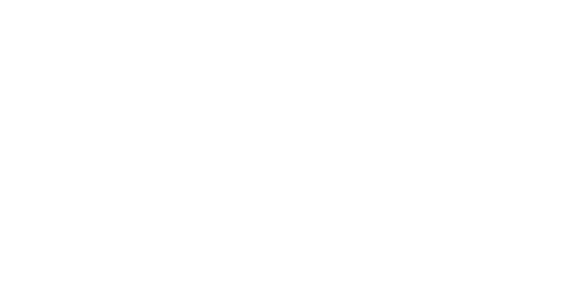
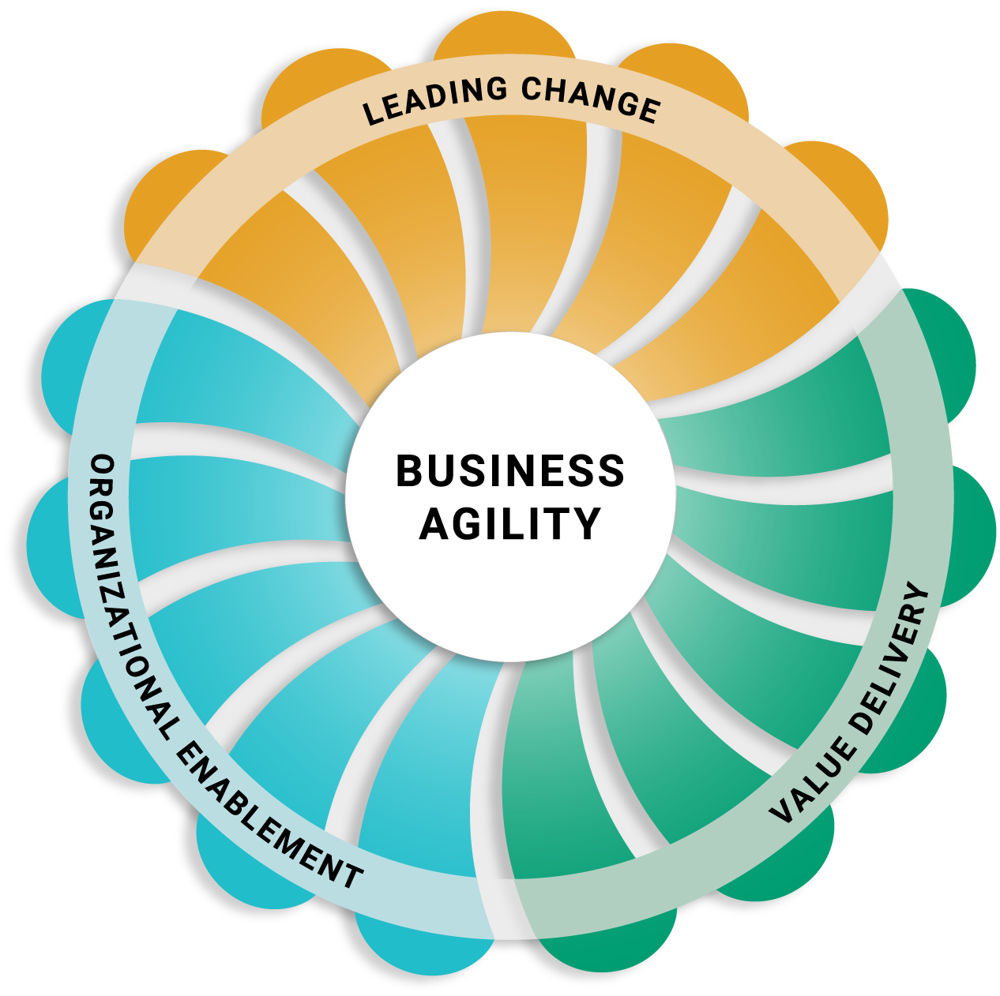
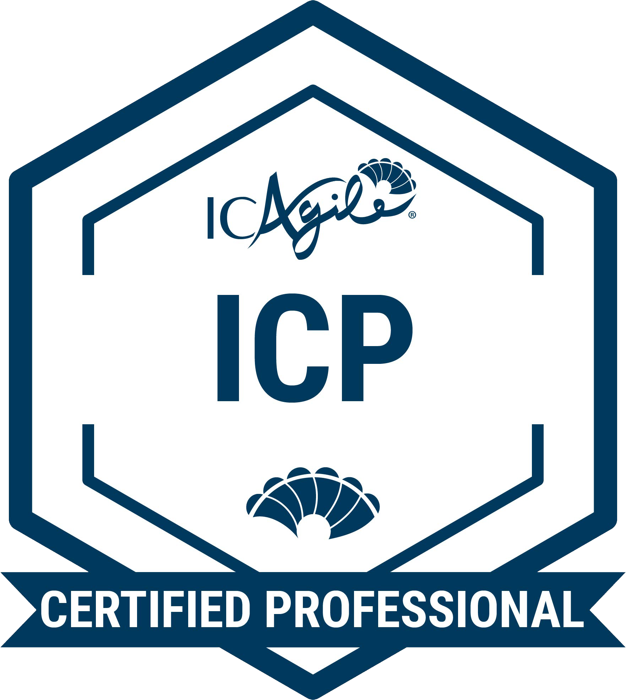
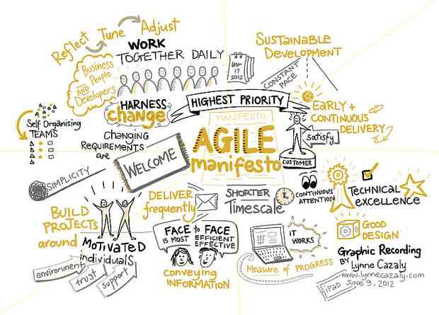

<!-- _backgroundColor: #003b5c -->

# THIS COURSE IS ACCREDITED BY

 
 

---

<!-- _backgroundColor: #003b5c -->

<video src="img/Welcome-to-your-ICAgile.mp4" controls />

---

## LEADING CHANGE

Realize sustainable agility through cultural change, not process change.

## VALUE DELIVERY

Delight your target audience with effective high-quality products and customer-centric outcomes.

## ORGANIZATIONAL ENABLEMENT

Build adaptive capability across the organization through dynamic structures and systems.

---

    
    <h1>Agile Fundamentals</h1>

<main>
    <article>
        <b>ABOUT THIS CERTIFICATION</b>
        
Agile Fundamentals (ICP) is an industry-recognized credential that demonstrates an understanding of the Agile mindset, values, principles, and foundational concepts. Professionals are grounded in what it means to "be agile while doing agile" and achieve organizational agility without specific focus on any single agile methodology or framework (i.e. Scrum, Kanban, XP, DSDM, SAFe, etc.).

    </article>
    <article>
        <b>FEATURED LEARNING OUTCOMES</b>
        <ul>
            <li>Origins of Agile</li>
            <li>Establishing the Agile Mindset</li>
            <li>Incremental Development</li>
            <li>Product Adaptation</li>
        </ul>
         
        <b>DESIGNED FOR</b>
        
Professionals who are in technical and product roles and are starting their agile learning journey.

    </article>
</main>

<footer>
    <a href="https://www.icagile.com/agile-certification" target="_blank">Go to ICAgile Learning Programs</a>
</footer>

---

# How does Agile relate to your new career?

---

<main>
    <h1>History of Agile / Agile Manifesto</h1>
    
</main>